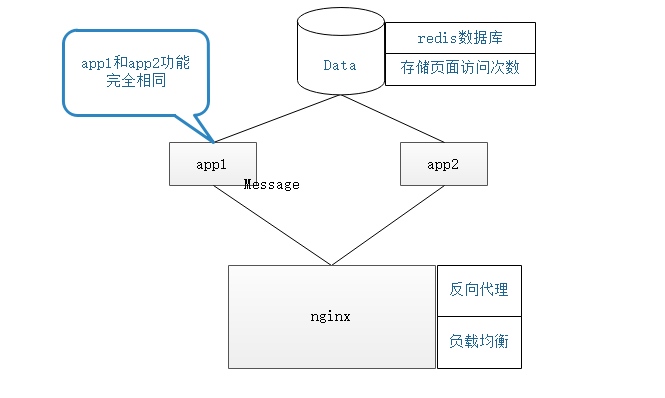
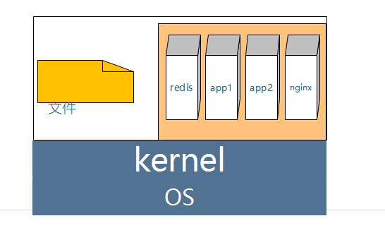

# Docker部署方案
## 需求
假设我们需要部署一个web应用：web框架采用flask,数据库选用redis,nginx作为负载分担和反向代理。组织架构图如下。

## 部署
docker部署分两种
* 采用集装箱式部署：将所有的依赖环境和源码构成一个单独的容器
* 采用组合式部署: 将不同的功能和模块构建成不同的容器，然后通过docker命令将多个容器和源码组合链接起来
这里以组合式部署为例


整体部署框架如上图所示，底层是OS和kernel，docker服务和源码文件运行在OS上。docker上创建了四个容器，分别是redis、app1、app2、nginx。源码挂载到docker中的app1和app2中相应的文件夹下。这四个基础的小容器和以从官网下载或者由Dockerfile创建。之后通过
docker-compose.yml管理多个容器。启动时只需运行：
```
docker-compose up
```

docker-compose.yml
```
# filename:
version: '2.0'
services:
  nginx:
    build: ./nginx
    ports:
     - 80:80
    restart: always
    links:
    - app1
    - app2
  app1:
    build: ./flask
    restart: always
    volumes:
    - ./src:/app
    links:
    - db

    command: python /app/hello.py
  
  app2:
    build: ./flask
    restart: always
    volumes:
    - ./src:/app
    links:
    - db
    command: python /app/hello.py
    

  db:
    image: redis:4.0-alpine   
    restart: always

  ```

### flask基础镜像的创建
容器app1和app2都依赖于flask镜像，flask镜像创建可以参考falsk/Dockerfile
### nginx容器创建
nginx容器直接在官方镜像的基础上添加本地配置文件获得的。其中的配置文件主要是关于flask和nginx的负载均衡
```sh
upstream mysvr {
       
        server app1:5000 weight=5;
      
        server app2:5000    weight=1;
    
    }
        

server {
    listen  80;

    location / {
        proxy_set_header Access-Control-Allow-Origin *;
        proxy_pass_header Server;
        proxy_set_header Host $http_host;
        proxy_redirect off;
        proxy_set_header X-Real-IP $remote_addr;
        proxy_set_header X-Scheme $scheme;
        proxy_pass http://mysvr;
    }
}

```

## 容器的导出与分发
在本地上生成容器后，只要push的Docker服务器上，在其他机器上只要pull相应的容器，相关的依赖环境就创建好了。这种方式最 直接，然而dockerhub官网TM的慢。所以不得不折衷采用另一种比较渣的方式
本地导出
```
docker ps -a
ONTAINER ID        IMAGE               COMMAND                  CREATED             STATUS                     PORTS                NAMES
78fe261141c9        app_app2            "/bin/sh"                4 hours ago         Exited (0) 4 hours ago                          app2
81ba99df1279        app_nginx           "nginx -g 'daemon ..."   4 hours ago         Up 4 hours                 0.0.0.0:80->80/tcp   app_nginx_1
c0e22122bae2        app_app1            "python /app/hello.py"   4 hours ago         Exited (137) 2 hours ago                        app_app1_1
bd84842d5fa7        app_app2            "python /app/hello.py"   4 hours ago         Up 2 hours                                      app_app2_1
c4aa364e2a01        redis:4.0-alpine    "docker-entrypoint..."   4 hours ago         Up 4 hours                 6379/tcp             app_db_1
docker export 78fe261141c9   >app_app2.tar
```

服务器导入
```
cat app_app2.tar>docker import - tramy/app_app2:1.0
```